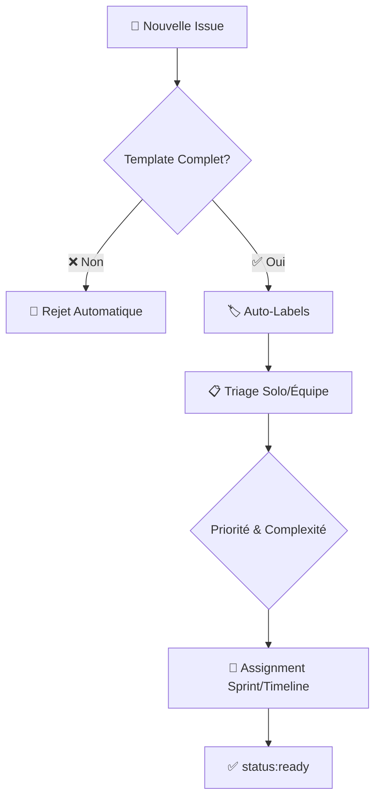
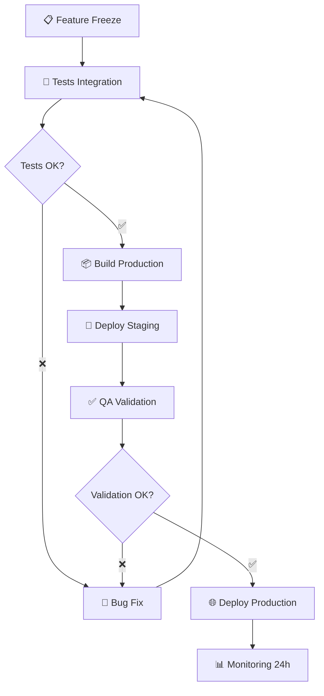

# 📋 Organisation Projet - Next.js/Nest.js STRICT

**Gestion INTRANSIGEANTE des issues, sprints et releases**

---

## 🎯 Philosophie de Gestion

> **"Mesurer, Planifier, Exécuter, Livrer"** - Odoo SA

Standards d'organisation rigoureux pour équipe 1-3 dev avec contraintes délais réelles.

---

## 📝 Système d'Issues STRICT

### Template d'Issue OBLIGATOIRE

```markdown
---
name: 🐛 Bug Report / ✨ Feature Request / ⚡ Improvement
about: Template standardisé Next.js/Nest.js
title: '[EMOJI] Module: Description courte en français'
labels: ''
assignees: ''
---

## 🎯 Type d'Issue
- [ ] 🐛 **BUG** - Correction nécessaire
- [ ] ✨ **FEATURE** - Nouvelle fonctionnalité  
- [ ] ⚡ **IMPROVEMENT** - Amélioration existante
- [ ] ♻️ **REFACTOR** - Refactoring technique
- [ ] 📝 **DOCUMENTATION** - Mise à jour docs
- [ ] 🧪 **TEST** - Tests uniquement
- [ ] 🔧 **CONFIG** - Configuration/outils

## 📋 Description OBLIGATOIRE

### Contexte Métier
**Problème résolu / Valeur apportée :**
[Description claire de l'impact business]

**Utilisateurs impactés :**
[Qui bénéficie de ce changement]

**Criticité :**
- [ ] 🔴 **CRITIQUE** - Bloque production
- [ ] 🟠 **HAUTE** - Impact utilisateur majeur  
- [ ] 🟡 **MOYENNE** - Amélioration notable
- [ ] 🟢 **BASSE** - Nice to have

## 🔍 Détails Techniques (Bug uniquement)

### Environnement Next.js/Nest.js
- **Version Next.js :** [ex: 14.1.0]
- **Version Nest.js :** [ex: 10.3.0]
- **Version Node :** [ex: 20.11.0]
- **OS :** [Linux/Windows/macOS]
- **Browser :** [Chrome/Firefox/Safari + version]
- **Database :** [PostgreSQL + version]

### Reproduction du Bug
**Étapes exactes :**
1. Aller à la page [URL/Route Next.js]
2. Cliquer sur [Élément/Composant]  
3. Envoyer requête à [Endpoint Nest.js]
4. Voir l'erreur

**Comportement actuel :**
[Décrire ce qui se passe actuellement]

**Comportement attendu :**
[Décrire ce qui devrait se passer]

**Logs/Screenshots :**
[Console browser, logs Nest.js, stack traces TypeScript]

**Stack trace complet (si applicable) :**
```
[Coller le stack trace complet ici]
```

## 🏗️ Spécifications Techniques (Feature/Improvement)

### Architecture Impact Next.js/Nest.js
**Modules Frontend impactés :**
- [ ] Pages/Routes Next.js
- [ ] Composants UI  
- [ ] Services/API calls
- [ ] Types TypeScript
- [ ] Middleware Next.js

**Modules Backend impactés :**
- [ ] Controllers Nest.js
- [ ] Services/Providers
- [ ] Entities/DTOs
- [ ] Middleware/Guards  
- [ ] Database/Migrations

**Dépendances :**
[Autres issues/PRs nécessaires avant]

**Breaking Changes :**
- [ ] **OUI** - Rupture API/Schema/Types
- [ ] **NON** - Rétrocompatible

### Maquettes/Spécifications
[Liens Figma, diagrammes, specs techniques]

## ✅ Critères d'Acceptation (OBLIGATOIRE)

**User Story :**
En tant que [UTILISATEUR], je veux [FONCTIONNALITÉ] afin de [BÉNÉFICE]

**Critères mesurables :**
- [ ] Critère 1: [Condition testable précise]
- [ ] Critère 2: [Condition testable précise] 
- [ ] Critère 3: [Condition testable précise]

**Tests de validation OBLIGATOIRES :**
- [ ] Tests unitaires couvrent nouveaux cas (Jest)
- [ ] Tests intégration API Nest.js (e2e)
- [ ] Tests E2E frontend si UI (Playwright/Cypress)
- [ ] Performance acceptable (< 3s chargement)
- [ ] Tests sécurité passent (si endpoints sensibles)

## 📊 Estimation & Planning

### Complexité (Fibonacci adaptée)
- [ ] **XS** - 1h (fix simple, typo)
- [ ] **S** - 1/2 jour (petit composant, endpoint simple)  
- [ ] **M** - 1-2 jours (feature standard)
- [ ] **L** - 3-5 jours (feature complexe, intégration)
- [ ] **XL** - 1-2 semaines (refonte majeure)

### Effort Détaillé Next.js/Nest.js
- **Frontend Next.js :** [X] heures
- **Backend Nest.js :** [Y] heures
- **Types TypeScript :** [Z] heures  
- **Tests :** [W] heures
- **Documentation :** [V] heures

### Dépendances & Risques
| Dépendance | Bloquant? | ETA | Notes |
|------------|-----------|-----|-------|
| Issue #123 | Oui | 15/01 | API auth requise |
| Service externe | Non | TBD | Fallback disponible |

| Risque | Impact | Probabilité | Mitigation |
|--------|--------|-------------|------------|
| Complexité TypeScript | H | M | POC préalable |
| Performance DB | M | L | Index + benchmarks |
| Breaking change API | H | L | Versioning API |

## 🏷️ Labels & Assignation OBLIGATOIRES

**Labels OBLIGATOIRES :**
- `type:bug/feature/improvement/refactor/docs/test/config`
- `priority:critical/high/medium/low`  
- `stack:frontend/backend/fullstack`
- `complexity:xs/s/m/l/xl`

**Labels Next.js/Nest.js spécifiques :**
- `nextjs:pages/components/api/middleware`
- `nestjs:controllers/services/guards/modules`
- `db:migration/query/schema`

**Assignation :**
- **Développeur :** [@username] (OBLIGATOIRE)
- **Reviewer :** [@username] (OBLIGATOIRE si équipe)

## 📅 Timeline

**Sprint Target :** Sprint XX (dates DD/MM - DD/MM)
**Milestone :** Release v2.2.0
**Deadline métier :** [Date limite client si applicable]

---

## 🔗 Références
- **Issues connexes :** #XXX, #YYY
- **Pull Requests :** #XXX
- **Documentation :** [Lien vers specs techniques]
- **Maquettes :** [Lien Figma/design]
```

### Labels STANDARDISÉS Next.js/Nest.js

```yaml
# .github/labels.yml - Configuration automatique
labels:
  # Type d'issue (emojis cohérents avec commits)
  - name: "type:bug"
    color: "d73a4a"
    description: "🐛 Correction de bug"
  
  - name: "type:feature" 
    color: "0075ca"
    description: "✨ Nouvelle fonctionnalité"
    
  - name: "type:improvement"
    color: "a2eeef" 
    description: "⚡ Amélioration existante"
    
  - name: "type:refactor"
    color: "7057ff"
    description: "♻️ Refactoring technique"
    
  - name: "type:docs"
    color: "0052cc"
    description: "📝 Documentation"
    
  - name: "type:test"
    color: "28a745"
    description: "🧪 Tests uniquement"

  - name: "type:config"
    color: "ffc107"
    description: "🔧 Configuration/outils"

  # Priorité
  - name: "priority:critical"
    color: "b60205"
    description: "🔴 Critique - Bloque production"
    
  - name: "priority:high"
    color: "d93f0b" 
    description: "🟠 Haute - Impact utilisateur majeur"
    
  - name: "priority:medium"
    color: "fbca04"
    description: "🟡 Moyenne - Amélioration notable"
    
  - name: "priority:low"
    color: "0e8a16"
    description: "🟢 Basse - Nice to have"

  # Complexité (Fibonacci)
  - name: "complexity:xs"
    color: "c2e0c6"
    description: "XS - 1h"
    
  - name: "complexity:s"
    color: "bfd4f2"
    description: "S - 1/2 jour"
    
  - name: "complexity:m" 
    color: "d4c5f9"
    description: "M - 1-2 jours"
    
  - name: "complexity:l"
    color: "f9d0c4"
    description: "L - 3-5 jours"
    
  - name: "complexity:xl"
    color: "f4c2c2"
    description: "XL - 1-2 semaines"

  # Stack technique
  - name: "stack:frontend"
    color: "1d76db"
    description: "🎨 Frontend Next.js"
    
  - name: "stack:backend"
    color: "0052cc"
    description: "🔧 Backend Nest.js"
    
  - name: "stack:fullstack"
    color: "5319e7"
    description: "🔗 Fullstack Next.js+Nest.js"
    
  - name: "stack:database"
    color: "b60205"
    description: "🗄️ Database PostgreSQL"

  # Next.js spécifique
  - name: "nextjs:pages"
    color: "000000"
    description: "📄 Pages Next.js"

  - name: "nextjs:components"
    color: "0366d6"
    description: "🧩 Composants React"

  - name: "nextjs:api"
    color: "28a745"
    description: "🔌 API Routes Next.js"

  # Nest.js spécifique  
  - name: "nestjs:controllers"
    color: "e74c3c"
    description: "🎮 Controllers Nest.js"

  - name: "nestjs:services"
    color: "9b59b6"
    description: "⚙️ Services/Providers"

  - name: "nestjs:guards"
    color: "f39c12"
    description: "🛡️ Guards/Middleware"

  # Statut workflow
  - name: "status:triage"
    color: "ffffff"
    description: "📋 En attente de triage"
    
  - name: "status:ready"
    color: "c2e0c6"
    description: "✅ Prêt pour développement"
    
  - name: "status:in-progress"
    color: "fbca04"
    description: "⏳ En cours de développement"
    
  - name: "status:review"
    color: "d4c5f9"
    description: "👁️ En review"
    
  - name: "status:blocked"
    color: "b60205"
    description: "🚫 Bloqué"
    
  - name: "status:done"
    color: "0e8a16" 
    description: "✅ Terminé"
```

---

## 🎯 Workflow d'Issues INTRANSIGEANT

### 1. Création & Triage



### Critères de Validation STRICT

**✅ Issue ACCEPTÉE si :**
- Template 100% complété en français
- Critères d'acceptation mesurables (min 2)
- Complexité estimée (XS à XL)
- Labels obligatoires présents
- Assignation développeur définie

**❌ Issue REJETÉE si :**
- Description vague ("améliorer l'interface")
- Pas de critères d'acceptation
- Pas d'estimation de complexité
- Mélange plusieurs fonctionnalités
- Pas de contexte métier

---

## 🏃 Méthodologie Agile ADAPTÉE

### Sprint Planning PRAGMATIQUE

```markdown
# 📋 Template Sprint Planning - Équipe 1-3 Dev

## 🎯 Sprint XX - [Dates: DD/MM - DD/MM] (2 semaines MAX)

### Objectif Sprint
**Thème :** [Ex: Amélioration authentification utilisateurs]

**Valeur métier :**
[Pourquoi ce sprint ? Quel problème business résolu ?]

### 📊 Capacité Équipe Réaliste

| Développeur | Disponibilité | Velocity | Points Attribués |
|-------------|---------------|----------|------------------|
| Dev Solo    | 90% (9j)      | 20 pts   | 18 points        |
| Dev 2       | 70% (7j)      | 15 pts   | 10 points        |
| Dev 3       | 50% (5j)      | 12 pts   | 6 points         |
| **TOTAL**   | **21j**       | **47pts**| **34 points**    |

### 📋 Backlog Sprint PRIORISÉ

#### 🔴 CRITIQUE (Must Have) - 60% capacité
| Issue | Points | Stack | Assigné | Notes |
|-------|--------|-------|---------|--------|
| #123  | 8      | Backend | Dev 1   | API auth |
| #124  | 5      | Frontend | Dev 2   | Login UI |

**Subtotal Critique :** 13 points (38% capacité)

#### 🟠 HAUTE (Should Have) - 30% capacité  
| Issue | Points | Stack | Assigné | Notes |
|-------|--------|-------|---------|--------|
| #125  | 5      | Fullstack | Dev 1   | 2FA |
| #126  | 3      | Frontend | Dev 2   | Dashboard |

**Subtotal Haute :** 8 points (24% capacité)

#### 🟡 MOYENNE (Could Have) - 10% capacité
| Issue | Points | Stack | Assigné | Notes |
|-------|--------|-------|---------|--------|
| #127  | 3      | Config | Dev 3   | Docker |

**Subtotal Moyenne :** 3 points (9% capacité)

**🎯 TOTAL SPRINT :** 24 points (71% capacité - buffer 29%)

### ⚠️ Risques & Contraintes

| Risque | Impact | Probabilité | Mitigation |
|--------|--------|-------------|------------|
| Congés Dev 2 fin sprint | H | Confirmé | Redistribuer tasks |
| Complexité technique #123 | M | M | Pair programming |
| Dépendance API externe | L | L | Mock/fallback |

### ✅ Definition of Done Sprint
- [ ] Toutes issues CRITIQUE terminées
- [ ] 80% issues HAUTE terminées  
- [ ] Tests passent (coverage >80%)
- [ ] TypeScript 0 erreur
- [ ] Aucun bug critique en prod
- [ ] Code review 100% fait
```

### Daily Standup MINIMALISTE (Solo/Équipe)

```markdown
# 🗓️ Daily Check - [Date] (5min MAX solo, 10min équipe)

## Solo Développement
**✅ Hier :**
- Issue #123: Auth service 70% (tests restants)
- Code review PR #45

**🎯 Aujourd'hui :**
- Issue #123: Finaliser + tests
- Commencer #124: Login UI

**🚫 Blocages :**
- Attente validation design login
- Problème config test DB locale

---

## Équipe 2-3 Dev

### 👤 [Dev 1]
**✅ Hier :** Issue #123 auth backend 90%
**🎯 Aujourd'hui :** Tests + PR + start #125  
**🚫 Blocages :** RAS
**📊 Sprint :** +5 pts | 8 pts restants

### 👤 [Dev 2]  
**✅ Hier :** Design login validé + composant base
**🎯 Aujourd'hui :** Intégration API auth #123
**🚫 Blocages :** Attente merge PR #123
**📊 Sprint :** +3 pts | 7 pts restants

### 📊 Sprint Health Check
- **Burn-down :** 40% terminé / 50% temps écoulé ⚠️
- **Vélocité :** Légèrement en retard  
- **Risques :** Dev 2 congés J+3, redistribuer tâches

### 🎯 Actions Immédiates
- [ ] Dev 1: Merger PR #123 avant 14h
- [ ] Dev 2: Tests UI après merge
- [ ] Tous: Point architecture 2FA demain
```

---

## 🔄 Release Management ADAPTÉ

### Process Release Simplifié



### Release Notes Template (français)

```markdown
# 🚀 Release v2.1.0 - [Date] - Next.js/Nest.js

## 📋 Aperçu
**Type :** Release Majeure/Mineure/Patch
**Stack :** Next.js 14.1.0 + Nest.js 10.3.0 + PostgreSQL 16
**Rollback :** Disponible (RTO: 10min)

---

## ✨ Nouvelles Fonctionnalités

### 🔐 Authentification 2FA (#123, #124, #125)
**Frontend Next.js :**
- Composant configuration 2FA utilisateur
- Pages login avec support TOTP
- Interface gestion codes de backup

**Backend Nest.js :**
- Endpoints TOTP generation/validation  
- Guards authentification 2FA
- Service email codes de backup

**Impact Utilisateur :** Sécurité renforcée, setup initial requis
**Migration :** Automatique, opt-in utilisateurs

### 📊 Dashboard Analytics (#126, #127)
**Frontend Next.js :**
- Page dashboard avec Chart.js
- Composants métriques temps réel
- Export PDF/CSV des données

**Backend Nest.js :**
- API métriques agrégées
- Cron jobs calcul statistiques  
- Cache Redis pour performance

**Impact Utilisateur :** Nouvelles données disponibles

---

## ⚡ Améliorations

### 🚀 Performance Optimizations (#128)
**Frontend :**
- Bundle size réduit de 25% (tree-shaking)
- Lazy loading composants non-critiques
- Images optimisées avec Next.js Image

**Backend :**
- Queries DB optimisées (-40% temps réponse)
- Connection pooling PostgreSQL
- Cache stratégique endpoints fréquents

**Métriques :**
- Time to First Byte : 150ms → 95ms
- Page Load Time : 2.1s → 1.4s

---

## 🐛 Corrections de Bugs

### 🔴 Bugs Critiques
- **#132:** Faille sécurité reset password
  - **Impact :** Tokens faibles exploitables
  - **Fix :** Tokens cryptographiquement sécurisés + expiration
  
- **#133:** Race condition mise à jour simultanées
  - **Impact :** Corruption données utilisateur
  - **Fix :** Optimistic locking + retry logic

### 🟠 Bugs Importants
- **#134:** Notifications email non envoyées
- **#135:** Export PDF format cassé
- **#136:** Recherche caractères spéciaux

**Total bugs résolus :** 12 (2 critiques, 5 importants, 5 mineurs)

---

## 🏗️ Changements Techniques

### Stack Updates
- **Next.js 13.5 → 14.1** (App Router stable)
- **Nest.js 10.2 → 10.3** (Performance improvements)  
- **PostgreSQL 15 → 16** (JSON improvements)
- **TypeScript 5.3** (Nouvelles features)

### API Changes  
⚠️ **BREAKING CHANGES :**
- **Auth API v2** : `/api/auth/*` → `/api/v2/auth/*`
- **User API** : Champ `avatar` maintenant objet complet
- **Migration automatique** fournie dans release

**Non-Breaking :**
- Nouveaux endpoints `/api/v2/analytics/*`
- Query params étendus recherche utilisateurs

---

## 📊 Métriques & Performance

| Métrique | v2.0.0 | v2.1.0 | Amélioration |
|----------|--------|--------|--------------| 
| Bundle size | 2.1MB | 1.6MB | 24% |
| API response avg | 180ms | 110ms | 39% |
| Database queries | 15/req | 9/req | 40% |
| Memory usage | 380MB | 290MB | 24% |

### Qualité Code
- **Test Coverage :** 84% (+12% vs v2.0.0)
- **TypeScript :** 0 `any`, 100% typé
- **ESLint :** 0 erreur, 0 warning
- **Performance Score :** 96/100

---

## 🚀 Déploiement

### Timeline
- **Feature Freeze :** 15/01/2024
- **Tests Phase :** 16-18/01/2024
- **Staging Deploy :** 19/01/2024
- **Production Deploy :** 22/01/2024 09:00 CET

### Rollback Plan
**RTO :** 10 minutes
**RPO :** 0 (transactions protégées)

**Triggers automatiques :**
- Error rate > 5%
- Response time > 3x baseline  
- Memory usage > 80%

---

## 📋 Post-Release

### Monitoring 48h
- [ ] Métriques performance
- [ ] Logs erreurs
- [ ] Retours utilisateurs
- [ ] Health checks API

### Actions J+7
- [ ] Analyse adoption nouvelles features
- [ ] Feedback utilisateurs consolidé
- [ ] Planification hotfix si nécessaire

---

## 👥 Équipe

**Développement :**
- Dev 1 - Frontend Next.js + coordination
- Dev 2 - Backend Nest.js + DevOps
- Dev 3 - Tests + QA

**Remerciements :** Beta testeurs, utilisateurs early adopters

---

## 🔗 Liens Utiles

- **📚 Documentation :** [/docs/v2.1-migration]
- **🐛 Bug Reports :** [GitHub Issues]
- **💬 Support :** [Contact/Discord]
- **🔄 Migration Guide :** [Guide automatique]
```

---

## 📊 Métriques KPIs ADAPTÉES

### Dashboard Équipe Réduite

```typescript
// scripts/simple-metrics.ts
interface TeamMetrics {
  // Issues
  issuesCreated: number;
  issuesClosed: number;
  avgCycleTime: number; // heures
  
  // Développement  
  commitCount: number;
  prCount: number;
  codeReviewTime: number; // heures
  
  // Qualité
  testCoverage: number; // %
  bugCount: number;
  techDebt: number; // TODO count
  
  // Performance
  buildTime: number; // secondes
  deployFrequency: number; // par semaine
}

const generateWeeklyReport = async (): Promise<TeamMetrics> => {
  // Collecte données via GitHub API
  const issues = await fetchGitHubIssues();
  const prs = await fetchGitHubPRs(); 
  const commits = await fetchGitHubCommits();
  
  return {
    issuesCreated: issues.filter(i => isThisWeek(i.created_at)).length,
    issuesClosed: issues.filter(i => i.closed_at && isThisWeek(i.closed_at)).length,
    avgCycleTime: calculateAvgCycleTime(issues),
    
    commitCount: commits.length,
    prCount: prs.length,
    codeReviewTime: calculateAvgReviewTime(prs),
    
    testCoverage: await getTestCoverage(),
    bugCount: issues.filter(i => i.labels.includes('type:bug')).length,
    techDebt: await countTodoComments(),
    
    buildTime: await getLastBuildTime(),
    deployFrequency: await getDeployFrequency()
  };
};
```

---

## 🎯 Application Immédiate

### 1. Setup GitHub Issues (10-15min)

```bash
#!/bin/bash
# scripts/setup-issues.sh

echo "📋 Configuration Issues GitHub Next.js/Nest.js"

# 1. Labels essentiels
gh label create "type:bug" --color "d73a4a" --description "🐛 Bug" --force
gh label create "type:feature" --color "0075ca" --description "✨ Feature" --force  
gh label create "stack:frontend" --color "1d76db" --description "🎨 Next.js" --force
gh label create "stack:backend" --color "0052cc" --description "🔧 Nest.js" --force
gh label create "complexity:s" --color "bfd4f2" --description "S - 1/2j" --force

# 2. Issue template
mkdir -p .github/ISSUE_TEMPLATE
cat > .github/ISSUE_TEMPLATE/feature.yml << 'EOF'
name: ✨ Feature Request
description: Nouvelle fonctionnalité Next.js/Nest.js
title: "✨ [Module]: Description courte"
labels: ["type:feature", "status:triage"]
body:
  - type: dropdown
    id: stack
    attributes:
      label: Stack impactée
      options:
        - Frontend Next.js
        - Backend Nest.js  
        - Fullstack
        - Database
    validations:
      required: true
      
  - type: textarea
    id: description
    attributes:
      label: Description métier
      placeholder: Pourquoi cette fonctionnalité ? Quel problème résout-elle ?
    validations:
      required: true
EOF

echo "✅ GitHub Issues configuré !"
```

### 2. Premier Sprint (Template)

```bash
#!/bin/bash  
# scripts/init-sprint.sh

echo "🏃 Initialisation premier sprint"

# Créer milestone
gh api repos/:owner/:repo/milestones \
  --method POST \
  --field title="Sprint 1 - Auth & Dashboard" \
  --field description="Premier sprint focus authentification" \
  --field due_on="2024-01-31T00:00:00Z"

# Créer issues exemple
gh issue create \
  --title "✨ auth: implémenter login JWT" \
  --label "type:feature,stack:fullstack,complexity:m" \
  --body "## 📋 Description

Implémenter système login complet avec JWT.

## ✅ Critères d'acceptation  
- [ ] Endpoint POST /auth/login 
- [ ] Page login Next.js
- [ ] Stockage token sécurisé
- [ ] Middleware auth Nest.js

## 📊 Estimation: M (1-2 jours)"

echo "✅ Premier sprint initialisé !"
```

---

**🎯 RÉCAPITULATIF ORGANISATION**

| Aspect | Odoo SA Standard | Adapté Next.js/Nest.js |
|--------|------------------|-------------------------|
| **Templates** | Strict universel | Adapté stack JS/TS|
| **Labels** | 15+ standardisés | 10 essentiels + stack |  
| **Sprints** | 4 semaines max | 2 semaines (délais) |
| **Estimation** | Story points | Fibonacci heures/jours |
| **Langues** | Anglais | **Français strict** |
| **Outils** | Python/Odoo | **TypeScript/Node.js** |

